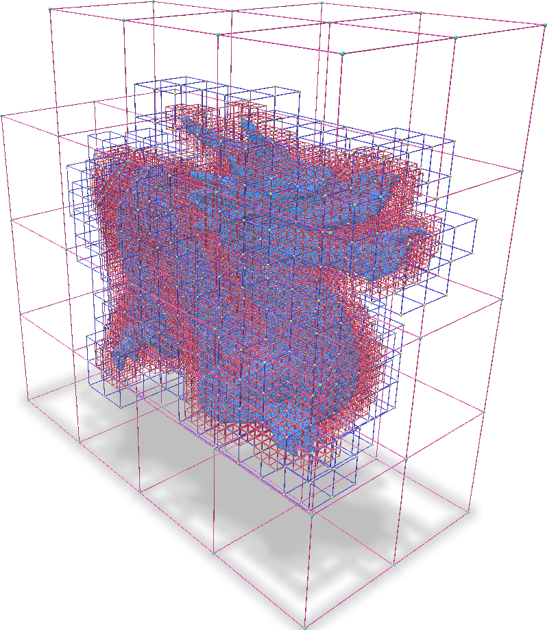

# *ƒ*(VDB)


This repository contains the code for *f*VDB, a data structure for encoding and operating on *sparse voxel hierarchies* of features in PyTorch. A sparse voxel hierarchy is a coarse-to-fine hierarchy of sparse voxel grids such that every fine voxel is contained within some coarse voxel. The image below illustrates an example. *f*VDB supports using PyTorch Tensors to represent features at the corners and centers of voxels in a hierarchy and enables a number of differentiable operations on these Tensors (*e.g.* trilinear interpolation, convolution, splatting, ray tracing).

<p align="center">
  
  <!--  -->
  <figcaption style="text-align: center; font-style: italic;">An example of a sparse voxel hierarchy with 3 levels. Each fine voxel is contained within exactly one coarse voxel.</figcaption>
</p>

## Learning to Use *f*VDB

After [installing *f*VDB](#installing-fvdb), we recommend starting with our walk-through [notebooks](notebooks) which provide a gentle, illustrated introduction to the main concepts and operations in *f*VDB.

Once familiar with the basics, [Usage Examples](#usage-examples) introduces a few of the useful python scripts that can be explored in the [examples](examples) directory.

Our [documentation](docs) provides a more detailed explanation of the concepts and operations available in *f*VDB as well as providing an API reference. The documentation can be built locally by following the instructions in the [Building Documentation](#building-documentation) section or can be accessed online at [TODO: insert link to online documentation].

## Installing *f*VDB

fVDB is provided as an installable python package from *[todo: insert package distributor]*.  We provide pre-built packages of the latest *f*VDB version for the following dependent library configurations:

|   PyTorch      | Python     | CUDA |
| -------------- | ---------- | ------- |
|  2.0.0-2.0.3  | 3.8 - 3.11 |   `cu121`   |
|  2.1.0-2.1.3  | 3.8 - 3.12 |   `cu121`   |
|  2.3.0        | 3.8 - 3.12 |   `cu121`   |


***Note:** Linux is the only platform currently supported (Ubuntu >= 20.04 recommended).


Use the following command to install `fvdb` into your environment.

```bash
TODO: Insert package install command
```

If you intend to use our learning material such as the [notebooks](notebooks) or [examples](examples), we recommend you start from the `fvdb_learn` conda environment which contains all the dependencies needed to run the learning material as well as build *f*VDB from source. To create this environment, run the following commands from the root of this repository:

```bash
conda env create -f env/learn_environment.yml
conda activate fvdb_learn
```


## Building *f*VDB from Source
*f*VDB is a Python library implemented as a C++ Pytorch extension.

**(Optional) Install libMamba for a huge quality of life improvement when using Conda**
```
conda update -n base conda
conda install -n base conda-libmamba-solver
conda config --set solver libmamba
```

### Conda Environment

Next, create the `fvdb` conda environment by running the following command from the root of this repository, and then grabbing a ☕:
```shell
conda env create -f env/test_environment.yml
```

**Note:**  You can optionally use the `env/build_environment.yml` environment file if you want a minimum set of dependencies needed to build *f*VDB and don't intend to run the tests or the `env/learn_environment` if you would like the additional packages needed to run the examples and view their visualizations.

Now activate the environment:
```shell
conda activate fvdb_test
```


### Building *f*VDB

**:warning: Note:** Compilation can be very memory-consuming. We recommend setting the `MAX_JOBS` environment variable to control compilation job parallelism with a value that allows for one job every 2.5GB of memory:

```bash
export MAX_JOBS=$(free -g | awk '/^Mem:/{jobs=int($4/2.5); if(jobs<1) jobs=1; print jobs}')
```

You could either do an editable install with setuptools:
```shell
python setup.py develop
```
or directly install it to your site package folder if you are developing extensions:
```shell
pip install .
```


### Running Tests

To make sure that everything works by running tests:
```shell
python setup.py test
```

### Building Documentation

To build the documentation, simply run:
```shell
python setup.py build_ext --inplace
sphinx-build -E -a docs/ build/sphinx
# View the docs
open build/sphinx/index.html
```

### Docker Image

To build and test *f*VDB, we have the dockerfile available:
```shell
# Build fvdb
docker build . -t fvdb-dev
# Run fvdb (or replace with your command)
docker run -it --gpus all --rm \
  --user $(id -u):$(id -g) \
  --mount type=bind,source="$HOME/.ssh",target=/root/.ssh \
  --mount type=bind,source="$(pwd)",target=/fvdb \
  fvdb-dev:latest \
  conda run -n fvdb_test --no-capture-output python setup.py test
```


## Usage Examples
The [examples](examples) directory contains a number of useful illustrations using the `fvdb` Python package. The sections below show some notable examples and their outputs. Run all commands from the root of the repository.

### Trilinear sampling of grids
```
python examples/sample_trilinear.py
```
This script generates a grid with scalars at the corners of each voxel and samples this grid at points. The visualization below shows the points colored according to their sampled values as well as the values at grid corners.
<p align="center">
  
  <figcaption style="text-align: center; font-style: italic;">Trilinearly interpolate the corner values at the points.</figcaption>
</p>


### Trilinear splatting into grids
```
python examples/splat_trilinear.py
```
This script splats normals of a point cloud onto grid centers. The green arrows represent the values of the normals splatted onto each grid center
<p align="center">
  
  <figcaption style="text-align: center; font-style: italic;">Splat the normals at the blue points into the center of each grid cell. The green arrows are the splatted normals</figcaption>
</p>


### Tracing voxels along rays (hierarchical DDA)
```
python examples/ray_voxel_marching.py
```
This script demonstrates finding the first `N` voxels which lie along a ray (returning thier index as well as their entry and exit points).
<p align="center">
  
  <figcaption style="text-align: center; font-style: italic;">Find the voxels (yellow) which intersect the pink rays eminating from the green dot.</figcaption>
</p>


### Tracing contiguous segments along rays
```
python examples/ray_segment_marching.py
```
This script demonstrates finding the first `N` continuous segments of voxels which lie along a ray (returning thier index as well as their entry and exit points).
<p align="center">
  
  <figcaption style="text-align: center; font-style: italic;">Find the contiguous segments of voxels (red and blue lines) which intersect the cyan rays eminating from the pink dot.</figcaption>
</p>


### Backpropagating through sampling and splatting
```
python examples/overfit_sdf.py
```
This scripts fits SDF values at a grid corner to the SDF of a mesh using gradient descent.
<p align="center">
  
  <figcaption style="text-align: center; font-style: italic;">SDF values at grid corners (colored dots) fitted using gradient descent to the SDF of a mesh.</figcaption>
</p>

The following scripts also show how to bakcprop through splatting and sampling with fVDB:
```
python scripts/debug_grad_trilerp.py
```
```
python scripts/debug_grad_splat.py
```

## Code Structure
The main source code for fVDB lives in the [src](src) directory. There are several important files here:
* `src/python/Bindings.cpp` exposes functionality directly to Python. It is mainly a wrapper around the core classes such as `fvdb::GridBatch` and `fvdb::JaggedTensor`.
* `src/GridBatch.h` contains the implementation of `fvdb::GridBatch` which is the core data structure on which fVDB is built. A `GridBatch` acts as a map between `(i, j, k)` integer coordinates and offsets in linear memory. This mapping can be used to perform a host of operations. The methods in this class are mostly lightweight wrappers around a set of CPU and CUDA *kernels*. The function prototypes for these kernels are defined in `src/detail/ops/Ops.h`.
* `src/detail/ops/Ops.h` contains the function prototypes for the main kernels used by fVDB. Host and device kernel implementations are provided in the `src/detail/ops/*.cu` source files.
* `src/detail/autograd` contains C++ implementations of PyTorch autograd functions for differentiable operations.  `#include <detail/autograd/Autograd.h>` includes all of the functions in this directory.
* `src/detail/utils/nanovdb` contains a number of utilities which make it easier to use NanoVDB.


## References

Please consider citing this when using *f*VDB in a project. You can use the citation BibTeX:

```bibtex
@article{williams2024fvdb,
  title={fVDB: A Deep-Learning Framework for Sparse, Large-Scale, and High-Performance Spatial Intelligence},
  author={Williams, Francis and Huang, Jiahui and Swartz, Jonathan and Klar, Gergely and Thakkar, Vijay and Cong, Matthew and Ren, Xuanchi and Li, Ruilong and Fuji-Tsang, Clement and Fidler, Sanja and Sifakis, Eftychios and Museth, Ken},
  journal={ACM Transactions on Graphics (TOG)},
  volume={43},
  number={4},
  pages={133:1--133:15},
  year={2024},
  publisher={ACM New York, NY, USA}
}
```

## Contact