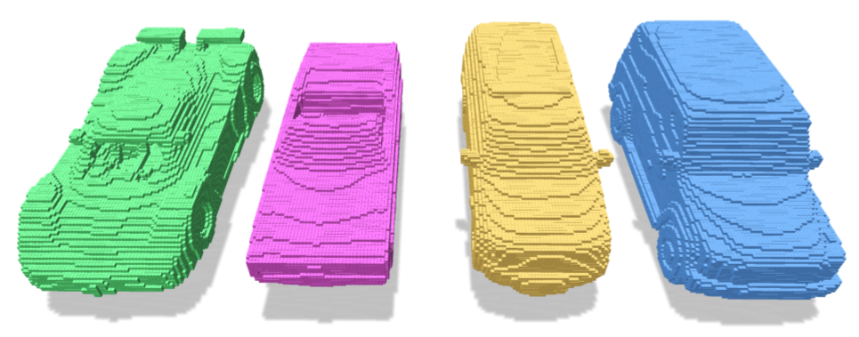
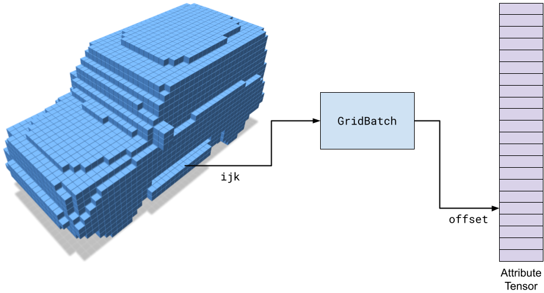
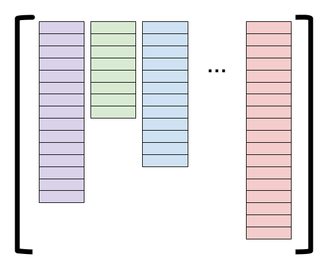
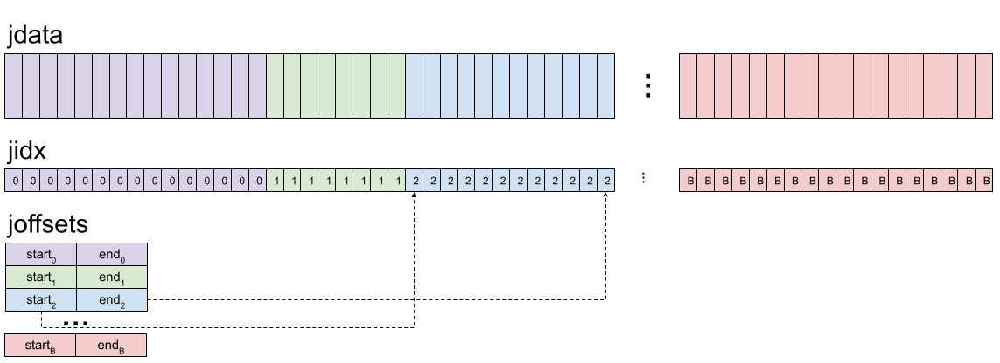

# Basic Concepts

We give a high-level overview of the main concepts in fVDB. Namely, how fVDB encodes sparse voxel grids with attributes, as well as how fVDB efficiently manages batches with non-uniform numbers of elements.

## `GridBatch`: Voxel Grids with Attributes

At its core, fVDB provides means to efficiently encode mini-batches of sparse voxel grids where each voxel contains arbitrary vector or scalar attributes encoded as torch tensors. In practice, such an encoding is implemented via the `GridBatch` class.



A `GridBatch` is an indexing structure which maps 3D `ijk` coordinates to integer offsets which can be used to look up attributes in a tensor. The figure below illustrates this process for a GridBatch containing a single grid.



In the figure, the `GridBatch` acts as an acceleration structure which encodes the sparsity pattern of the grid (also known as the **********topology**********) and can translate grid coordinates into offsets into a data tensor.

By separating the grid topology and data tensors, the same grid can be used to operate on many different attributes without rebuilding.

Every operation in fVDB is built upon this kind of query (e.g. Sparse Convolution uses this query to look up features in the neighborhood of each voxel).

## `JaggedTensor` and Batching

Each grid in a `GridBatch` can have a different number of voxels (****e.g.**** in the mini batch of four cars above, each car has a different number of voxels). This means that unlike the dense case, fVDB needs to handle parallel operations over ***jagged batches***. I.e. batches containing different numbers of elements.

To handle jagged batches, fVDB provides a `JaggedTensor` class. Conceptually, a `JaggedTensor` is a list of tensors with shapes $[N_0, *], [N_1, *], \ldots, [N_B, *]$ where $B$ is the number of elements in the batch, $N_i$ is the number of elements in the $i^\text{th}$ batch item and $*$ is an arbitrary numer of additional dimensions that all match between the tensors. The figure below illustrates such a list of tensors pictorially.



In practice, `JaggedTensor`s are represented in memory by concatenating each tensor in the list into a single `jdata` (for Jagged Data) tensor of shape $[N_0 + N_1 + \ldots + N_B, *]$. Additionally, each `JaggedTensor` stores an additional `jidx` tensor (for Jagged Indexes) of shape $[N_0 + N_1 + \ldots + N_B]$ containing one int16 per element in the jagged tensor. `jidx[i]` is the batch index of the $i^\text{th}$ element of `jdata`. Finally, a `JaggedTensor` contains a `joffsets` tensor (for Jagged Offsets) of shape $[B, 2]$ which indicates the start and end positions of the $i^\text{th}$ tensor in the batch.



Similarly, each `GridBatch` also has `jidx` and `joffsets` corresponding to the batch index of each voxel in the grid, and the start and end offsets of each voxel index in a batch.

## A simple example

To illustrate the use of `GridBatch`and `JaggedTensor`, consider a simple example where we build a grid from a point cloud, splat some values onto the voxels of that grid, and then sample them again using a different set of points.

```python
import fvdb
import torch
import point_cloud_utils as pcu

# We're going to create a minibatch of two point clouds each of which
# has a different number of points
pts1, clrs1 = pcu.load_mesh_vn("points1.ply")
pts2, clrs2 = pcu.load_mesh_vn("points2.ply")
pts1, clrs1 = torch.from_numpy(pts1).cuda(), torch.from_numpy(clrs1).cuda()
pts2, clrs2 = torch.from_numpy(pts2).cuda(), torch.from_numpy(clrs2).cuda()

# JaggedTensors of points and normals
points = fvdb.JaggedTensor([pts1, pts2])
colors = fvdb.JaggedTensor([clrs1, clrs2])

# Create a grid where the voxels each have unit sidelength
grid = fvdb.sparse_grid_from_points(points, voxel_sizes=1.0)

# Indexing into a JaggedTensor returns a JaggedTensor
print(points[0].jdata.shape)
print(points[1].jdata.shape)
```


We construct a minibatch of grids using the input points. These input points have corresponding color attributes

```python
# Splat the normals into the grid with trilinear interpolation
# vox_normals is a JaggedTensor of per-voxel normas
vox_colors = grid.splat_trilinear(points, colors)
```


We then splat the colors at the points to the constructed grid, yielding per-voxel colors.

```python
# Now let's generate some random points and sample the grid at those points
samples = fvdb.JaggedTensor([torch.rand(10_000, 3), torch.rand(11_000, 3)]).cuda()

# sampled_normals is a JaggedTensor with the same shape as samples with
# one normal sampled from the grid at each point in samples
sampled_normals = grid.sample_trilinear(samples)
```


We now generate a new set of noisy points and sample the grid colors to recover colors at those new samples.
