# Basic GridBatch Operations

Here we describe basic operations you can perform on a `GridBatch`. Generally, these operations involve a `GridBatch` and an associated `JaggedTensor` of data representing the attributes/features at each voxel within the grid.

## Sampling grids

You can differentiably sample data stored at the voxels of a grid using *trilinear* or *Bézier* interpolation as follows:

```python
import fvdb
import torch
import numpy as np
import point_cloud_utils as pcu

# We're going to create a minibatch of two meshes
v1, f1 = pcu.load_mesh_vn("mesh1.ply")
v2, f2 = pcu.load_mesh_vn("mesh2.ply")
v1, f1  = torch.from_numpy(v1).cuda(), torch.from_numpy(f1.astype(np.int32)).cuda()
v2, f2 = torch.from_numpy(pts2).cuda(), torch.from_numpy(f2.astype(np.int32)).cuda()

# Build a GridBatch from two meshes
mesh_v_jagged = fvdb.JaggedTensor([v1, v2]).cuda()
mesh_f_jagged = fvdb.JaggedTensor([f1, f2]).cuda()
grid = fvdb.sparse_grid_from_mesh(mesh_v_jagged, mesh_f_jagged, voxel_sizes=0.1)

# Generate some sample points by adding random gaussian noise to the center of each voxel
world_space_centers = grid.grid_to_world(grid.ijk.float())
# 5 samples per voxel for the first grid and 7 samples per voxel for the second
sample_pts = fvdb.JaggedTensor([
    torch.cat([world_space_centers[0].jdata] * 5),
    torch.cat([world_space_centers[1].jdata] * 7)])
sample_pts += fvdb.JaggedTensor([
    torch.randn(grid.num_voxels_at(0) * 5, 3).to(grid.device) * grid.voxel_sizes[0]*0.3,
    torch.randn(grid.num_voxels_at(1) * 7, 3).to(grid.device) * grid.voxel_sizes[1]*0.3])

# Generate RGB values per voxel as the normalized absolute grid coordinate of the voxel
per_voxel_colors = world_space_centers.clone()
per_voxel_colors.jdata = torch.abs(world_space_centers.jdata) / torch.norm(world_space_centers.jdata, dim=-1, keepdim=True)

# Sample these RGB colors at each sample point with trilinear interpolation
# NOTE: You can use grid.sample_bezier to sample using bezier interpolation
sampled_colors = grid.sample_trilinear(sample_pts, per_voxel_colors)
```

Grid with color attributes            |  Points with sampled colors
:------------------------------------:|:------------------------------------:
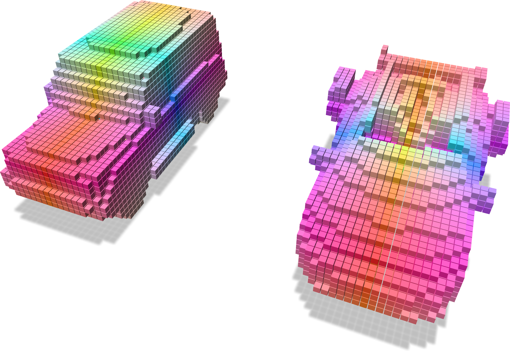       |  


## Splatting point data to a grid

You can differentiably splat data at a set of points into voxels in a grid using *trilinear* or *Bézier* interpolation as follows:

```python
import fvdb
import torch
import point_cloud_utils as pcu

# We're going to create a minibatch of two point clouds each of which
# has a different number of points
pts1, clrs1 = pcu.load_mesh_vn("points1.ply")
pts2, clrs2 = pcu.load_mesh_vn("points2.ply")
pts1, clrs1 = torch.from_numpy(pts1).cuda(), torch.from_numpy(clrs1).cuda()
pts2, clrs2 = torch.from_numpy(pts2).cuda(), torch.from_numpy(clrs2).cuda()

# JaggedTensors of points and normals
points = fvdb.JaggedTensor([pts1, pts2])
colors = fvdb.JaggedTensor([clrs1, clrs2])

# Create a grid where the voxels each have unit sidelength
grid = fvdb.sparse_grid_from_points(points, voxel_sizes=1.0)

# Splat the normals into the grid with trilinear interpolation
# vox_normals is a JaggedTensor of per-voxel normas
# NOTE: You can use grid.splat_bezier to splat using bezier interpolation
vox_colors = grid.splat_trilinear(points, colors)
```

Input grid and points with colors                     |  Splat colors onto the grid
:----------------------------------------------------:|:----------------------------------------------------:
       |  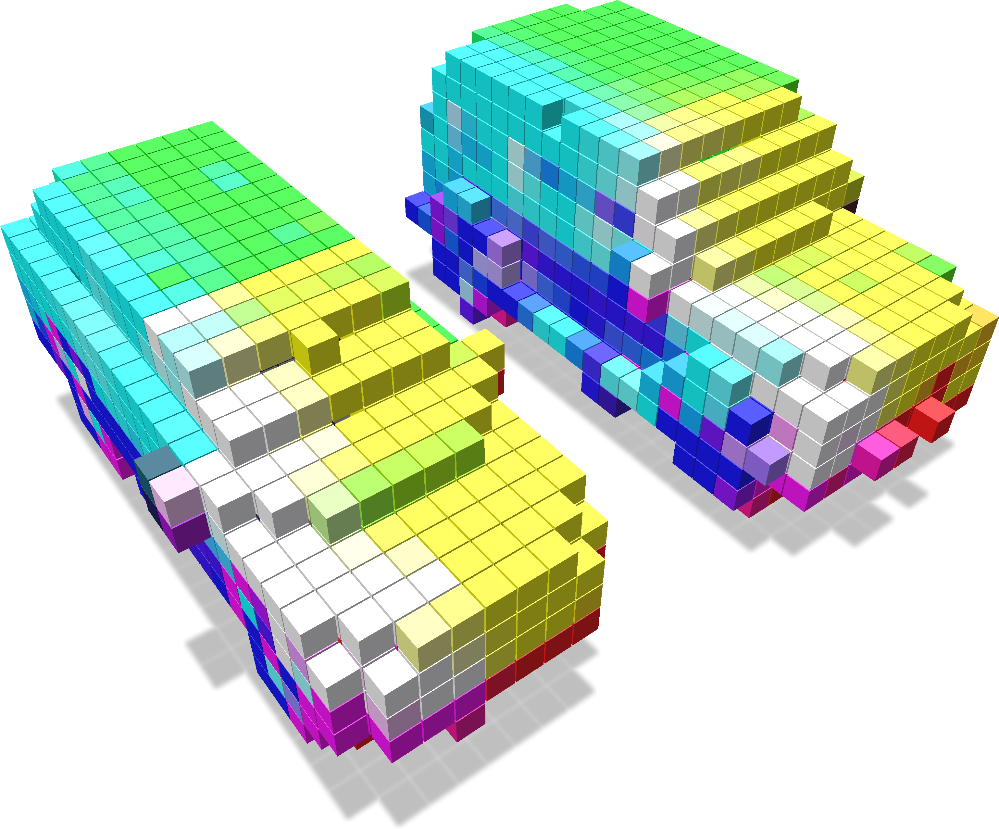


## Checking if points are in a grid

You can query whether points lie in a grid as follows:

```python
import fvdb
import torch
import numpy as np
import point_cloud_utils as pcu

# We're going to create a minibatch of two meshes
v1, f1 = pcu.load_mesh_vn("mesh1.ply")
v2, f2 = pcu.load_mesh_vn("mesh2.ply")
v1, f1  = torch.from_numpy(v1).cuda(), torch.from_numpy(f1.astype(np.int32)).cuda()
v2, f2 = torch.from_numpy(v2).cuda(), torch.from_numpy(f2.astype(np.int32)).cuda()

# Build a GridBatch from two meshes
mesh_v_jagged = fvdb.JaggedTensor([v1, v2]).cuda()
mesh_f_jagged = fvdb.JaggedTensor([f1, f2]).cuda()
grid = fvdb.sparse_grid_from_mesh(mesh_v_jagged, mesh_f_jagged, voxel_sizes=0.1)

# Generate some points and check if they lie within the grid
bbox_sizes = grid.bbox[:, 1] - grid.bbox[:, 0]
bbox_origins = grid.bbox[:, 0]
pts = fvdb.JaggedTensor([
    (torch.randn(10_000, 3, device='cuda') - bbox_origins) * bbox_sizes,
    (torch.randn(11_000, 3, device='cuda') - bbox_origins) * bbox_sizes,
])

# Get a mask indicating which points lie in the grid
mask = grid.points_in_active_voxel(pts)
```

We visualize the points which intersect the grid (yellow points intersect and purple points do not).


## Checking if ijk coordinates are in a grid

Similar to querying whether world space points lie in a grid, you can query whether the index space `ijk` integer coordinates lie in a grid as follows:

```python
import fvdb
import torch
import numpy as np
import point_cloud_utils as pcu
import polyscope as ps
import os


# We're going to create a minibatch of two meshes
v1, f1 = pcu.load_mesh_vn("mesh1.ply")
v2, f2 = pcu.load_mesh_vn("mesh2.ply")
v1, f1  = torch.from_numpy(v1).cuda(), torch.from_numpy(f1.astype(np.int32)).cuda()
v2, f2 = torch.from_numpy(v2).cuda(), torch.from_numpy(f2.astype(np.int32)).cuda()

# Build a GridBatch from two meshes
mesh_v_jagged = fvdb.JaggedTensor([v1, v2]).cuda()
mesh_f_jagged = fvdb.JaggedTensor([f1, f2]).cuda()
grid = fvdb.sparse_grid_from_mesh(mesh_v_jagged, mesh_f_jagged, voxel_sizes=0.025)

rand_idx_pts = []
for b, b_grid in enumerate(grid.bbox):
    pts = [torch.randint(int(b_grid[0][i]), int(b_grid[1][i]), size=(2_000 * (b+1),), device='cuda') for i in range(3)]
    rand_idx_pts.append(torch.stack(pts, dim=1))


pts = fvdb.JaggedTensor(rand_idx_pts)

coords_in_grid = grid.coords_in_active_voxel(pts)

```

We visualize the coordinates which intersect the grid (yellow coordinates intersect and purple coordinates do not).
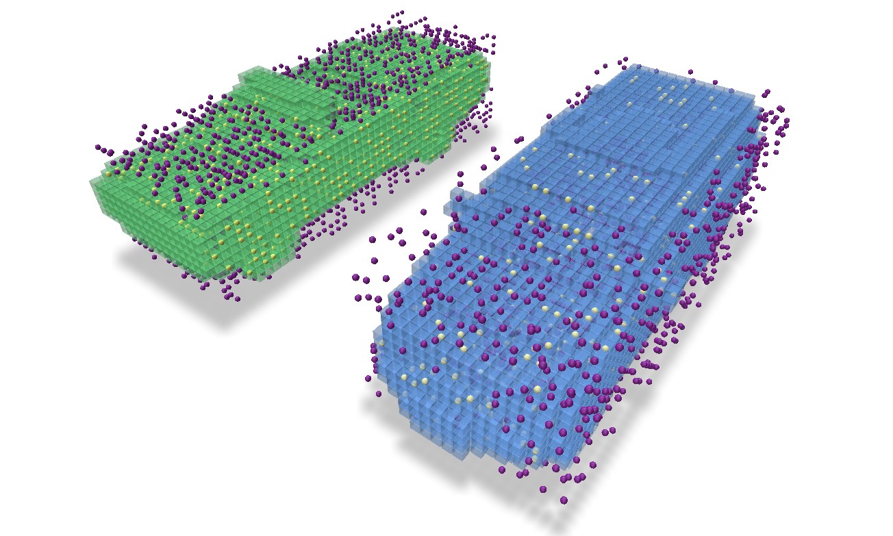

## Checking if axis aligned cubes intersect a grid

There are methods of a grid to help ascertain whether a provided set of axis-aligned cubes (all of the same size) each are contained within voxels of the grid or intersect with any voxel of the grid.  These methods are called `cubes_in_grid` and `cubes_intersect_grid`, respectively, and return a `JaggedTensor` of boolean values which indicate the result.

In this example we create some random points to represent the centers of cubes of size `0.03` units along-a-side. Then we use these two methods to discover which of those cubes would intersect a voxel of the grid and which would be entirely enclosed by a voxel in the grid.

```python
import fvdb
import torch
import numpy as np
import point_cloud_utils as pcu
import polyscope as ps
import os

# We're going to create a minibatch of two meshes
v1, f1 = pcu.load_mesh_vn("mesh1.ply")
v2, f2 = pcu.load_mesh_vn("mesh2.ply")
v1, f1 = torch.from_numpy(v1).cuda(), torch.from_numpy(f1.astype(np.int32)).cuda()
v2, f2 = torch.from_numpy(v2).cuda(), torch.from_numpy(f2.astype(np.int32)).cuda()

# Build a GridBatch from two meshes
mesh_v_jagged = fvdb.JaggedTensor([v1, v2]).cuda()
mesh_f_jagged = fvdb.JaggedTensor([f1, f2]).cuda()
grid = fvdb.sparse_grid_from_mesh(mesh_v_jagged, mesh_f_jagged, voxel_sizes=0.025)

# Generate some points and check if they lie within the grid
bbox_sizes = (grid.bbox[:, 1] - grid.bbox[:, 0]) * grid.voxel_sizes
bbox_origins = (grid.bbox[:, 0] + grid.origins) * grid.voxel_sizes
pts = fvdb.JaggedTensor(
    [
        (torch.rand(3000, 3, device="cuda")) * bbox_sizes[0] + bbox_origins[0],
        (torch.rand(2000, 3, device="cuda")) * bbox_sizes[1] + bbox_origins[1],
    ]
)

cube_size = 0.03

# We can check if the axis-aligned cubes intersect any voxels of the grid...
cubes_intersect_grid = grid.cubes_intersect_grid(pts, -cube_size / 2, cube_size / 2)
# ... or if they are fully contained within the grid
cubes_in_grid = grid.cubes_in_grid(pts, -cube_size / 2, cube_size / 2)
```

We visualize the cubes which intersect a voxel in the grid (yellow cubes intersect and purple cubes do not).
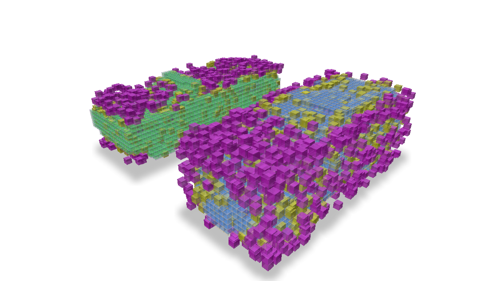


And which cubes lie entirely within a voxel of the grid


## Converting ijk values to indexes

There is a convenient method to convert ijk values, which are integer coordinates in the index space of a grid, to indexes, which are the linearized indices of the voxels in the GridBatch.  This method, `ijk_to_index`, returns a `JaggedTensor` of indexes.  If the provided ijk values do not correspond to any voxels in the grid, the returned index will be `-1`.

```python

import fvdb
import torch
import numpy as np
import point_cloud_utils as pcu
import polyscope as ps
import os

torch.random.manual_seed(0)

def generate_random_points(bounding_box, num_points):
    min_i, min_j, min_k = bounding_box[0]
    max_i, max_j, max_k = bounding_box[1]

    # Generate random integer points within the bounding box
    random_i = torch.randint(min_i, max_i, size=(num_points,))
    random_j = torch.randint(min_j, max_j, size=(num_points,))
    random_k = torch.randint(min_k, max_k, size=(num_points,))

    random_points = torch.stack([random_i, random_j, random_k], dim=1)

    return random_points

# We're going to create a minibatch of two meshes
v1, f1 = pcu.load_mesh_vf("mesh1.ply")
v2, f2 = pcu.load_mesh_vf("mesh2.ply")
v1, f1 = torch.from_numpy(v1).cuda(), torch.from_numpy(f1.astype(np.int32)).cuda()
v2, f2 = torch.from_numpy(v2).cuda(), torch.from_numpy(f2.astype(np.int32)).cuda()

# Build a GridBatch from two meshes
mesh_v_jagged = fvdb.JaggedTensor([v1, v2]).cuda()
mesh_f_jagged = fvdb.JaggedTensor([f1, f2]).cuda()
grid = fvdb.sparse_grid_from_mesh(mesh_v_jagged, mesh_f_jagged, voxel_sizes=0.025)

rand_pts = fvdb.JaggedTensor([generate_random_points(bbox, 1000) for bbox in grid.bbox]).cuda()

rand_pts_indices= grid.ijk_to_index(rand_pts)

print(rand_pts_indices.jdata)
```
```bash
tensor([  -1,   -1,  121,  ..., 4614, 5695,   -1], device='cuda:0')
```

## Converting indexes to ijk values

If we have the value of an index into the feature data and want to obtain its corresponding ijk value, this is as simple as indexing into the `ijk` attribute of the grid which is itself just a `JaggedTensor` representing the `ijk` values of each index.  Here we get the `ijk` values for 1000 random indexes of a `GridBatch`.

```python
rand_indexes = torch.randint(0, grid.total_voxels, size=(1000,)).cuda()
print(grid.ijk.jdata[rand_indexes])
```
```bash
tensor([[-11,   5,   7],
        [  8,  -4,  -5],
        [-15,   3,  -2],
        ...,
        [ 18,   1,   6],
        [ 19,  -3,   6],
        [-14,  -7,   8]], device='cuda:0', dtype=torch.int32)
```

However, you may also want to obtain the batch index of the grid that the `ijk` coordinate belongs to.  This is just as simple by using the `jidx` attribute of the `JaggedTensor` which represents the batch index of each element in the `JaggedTensor`.  Using the same random indexes as above, we can get the batch index of the grid for each random index.

```python
print(grid.ijk.jidx[rand_indexes])
```
```bash
tensor([0, 1, 1, 0, 1, 1, 0, 0, 1, 1, 0, 1, 0, 0, 0, 0, 1, 1, 0, 1, 1, 0, 1, 1,
        1, 1, 0, 1, 1, 0, 1, 0, 0, 1, 1, 0, 1, 1, 1, 0, 1, 1, 0, 1, 1, 0, 1, 1,
        0, 0, 1, 0, 0, 1, 1, 1, 0, 0, 0, 1, 0, 0, 0, 0, 0, 1, 1, 0, 0, 1, 1, 1,
        1, 0, 0, 0, 0, 1, 0, 1, 1, 0,…], device='cuda:0')
```

While this case of having a random set of `ijk` values is very contrived, it is more likely that we would have a `JaggedTensor` of features that correspond to each `ijk` value but are out-of-order in relation to another `grid.ijk`'s and we need to reorder these features to for this other grid.  For this, there is the `ijk_to_inv_index` function.

Given a `JaggedTensor` of `ijk` values, `grid_batch.ijk_to_inv_index` will return a scalar integer `JaggedTensor` of size `[B, -1]`, where `B` is the number of grids in the batch and -1 represents the number of voxels in each grid.  This `JaggedTensor` of indexes can be used to permute the input to `ijk_to_inv_index` (or the feature `JaggedTensor` that correspond to those `ijk`'s) to match the ordering of the `grid_batch`.

To concisely illustrate the properties of this function,
* if `idx = grid.ijk_to_inv_index(misordered_ijk)`, then `grid.ijk == misordered_ijk[idx]`
* if `idx = grid.ijk_to_index(misordered_ijk)`, then `grid.ijk[idx] == misordered_ijk`

Note:  If any `ijk` values in the grid are not present in the input to `ijk_to_inv_index`, the returned index will be `-1` at that position.

In this example, let's illustrate the more useful case where we have corresponding features and `ijk` values from a grid that are ordered differently from another reference grid and we want to re-order the features to match the order they should be in the reference grid.

```python
import fvdb
import torch
import numpy as np
import point_cloud_utils as pcu

# We're going to create a minibatch of two meshes
v1, f1 = pcu.load_mesh_vf("mesh1.ply")
v2, f2 = pcu.load_mesh_vf("mesh2.ply")
v1, f1 = torch.from_numpy(v1).float().cuda(), torch.from_numpy(f1.astype(np.int32)).cuda()
v2, f2 = torch.from_numpy(v2).float().cuda(), torch.from_numpy(f2.astype(np.int32)).cuda()

# Build a GridBatch from two meshes
mesh_v_jagged = fvdb.JaggedTensor([v1, v2]).cuda()
mesh_f_jagged = fvdb.JaggedTensor([f1, f2]).cuda()
reference_grid = fvdb.sparse_grid_from_mesh(mesh_v_jagged, mesh_f_jagged, voxel_sizes=0.025)

# 7 random feature values for each voxel in the grid
features = reference_grid.jagged_like(torch.rand(grid.total_voxels, 7).to(grid.device))

# Create a set of randomly shuffled corresponding ijk/features from our original grid/features
shuffled_ijks = []
shuffled_features = []

for i in range(reference_grid.grid_count):
    perm = torch.randperm(reference_grid.num_voxels_at(i))
    shuffled_ijks.append(reference_grid.ijk.jdata[grid.ijk.jidx==i][perm])
    shuffled_features.append(features.jdata[features.jidx==i][perm])

shuffled_ijks = fvdb.JaggedTensor(shuffled_ijks)
shuffled_features = fvdb.JaggedTensor(shuffled_features)

# Get the indexes to reorder the shuffled features to match the grid's original ijk ordering
idx = reference_grid.ijk_to_inv_index(shuffled_ijks)

# Permute the shuffled features based on the ordering from `ijk_to_inv_index`
unshuffled_features = shuffled_features.jdata[idx.jdata]
print("Do the shuffled features that have been permuted based on `ijk_to_inv_index` match the original features? ", "Yes!" if torch.all(unshuffled_features == features.jdata) else "No!")
```

```bash
Do the shuffled features that have been permuted based on `ijk_to_inv_index` match the original features?  Yes!
```


## Getting indexes of neighbors

If we want to get the indexes of all the spatial neighbors of a set of ijk values, we can use the `neighbor_indexes` method of a `GridBatch`.  This method receives a set of `ijk` values and an `extent` (the number of voxels away from the ijk value to consider neighbors) and returns a `JaggedTensor` of indexes of neighbors for each ijk value.  The returned `JaggedTensor` has `jdata` of size `[N, extent*2+1, extent*2+1, extent*2+1]` where `N` is the number of requested ijk values.

In this example we create a set of 24 random ijk values per grid and get the indexes of all neighbors 2 voxels away from each ijk.

```python
import fvdb
import torch
import numpy as np
import point_cloud_utils as pcu
import polyscope as ps
import os

# We're going to create a minibatch of two meshes
v1, f1 = pcu.load_mesh_vn("mesh1.ply")
v2, f2 = pcu.load_mesh_vn("mesh2.ply")
v1, f1 = torch.from_numpy(v1).cuda(), torch.from_numpy(f1.astype(np.int32)).cuda()
v2, f2 = torch.from_numpy(v2).cuda(), torch.from_numpy(f2.astype(np.int32)).cuda()

# Build a GridBatch from two meshes
mesh_v_jagged = fvdb.JaggedTensor([v1, v2]).cuda()
mesh_f_jagged = fvdb.JaggedTensor([f1, f2]).cuda()
grid = fvdb.sparse_grid_from_mesh(mesh_v_jagged, mesh_f_jagged, voxel_sizes=0.025)


# Build a set of 24 randomly selected ijk values per grid
rand_ijks = fvdb.JaggedTensor(
    [
        grid.ijk.jdata[
            torch.randint(int(grid.ijk.joffsets[b][0]), int(grid.ijk.joffsets[b][1]), (24,))
        ]
        for b in range(grid.grid_count)
    ],
)

# Get the indexes of all neighbors 2 voxels away from each ijk
# Returns a JaggedTensor with jdata of size [48, 5, 5, 5] ([ N x (extent*2+1)^3 ])
#   where each [5, 5, 5] describes the layout of neighbouring indexes of each ijk
neighbor_idxs = grid.neighbor_indexes(rand_ijks, 2)
```

We visualize the voxels we selected in red and their neighbors in blue.
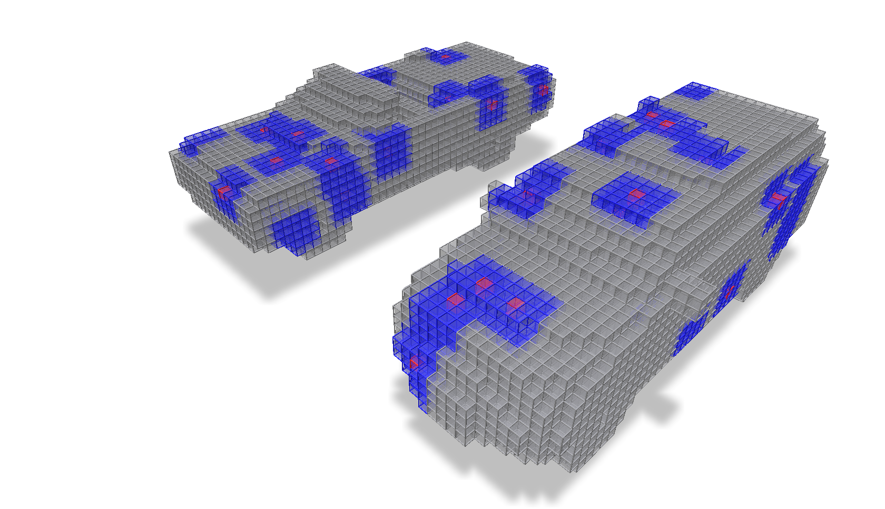


## Clipping a grid to a bounding box

If we want to 'clip' a grid, meaning remove all the voxels that are outside of a bounding box, we can use the `clipped_grid` method of a `GridBatch`.  The minimum and maximum `ijk` extents of the bounding box used for this clipping are provided as arguments and can be specified per-grid of the batch.

If we want to both clip the batch of grids and the accompanying `JaggedTensor` of batched features, we can use the `clip` method of a `GridBatch` which can be provided the `features` to be clipped along with the grid.

In this example we clip a batch of grids to independent bounding boxes and visualize the result.

```python
import os
import fvdb
import torch
import numpy as np
import point_cloud_utils as pcu

device = 'cuda'
mesh_vs = []
mesh_fs = []
mesh_files = ("car-25.ply", "car-24.ply", "car-68.ply", "car-194.ply")

for fname in mesh_files:
    v, f = pcu.load_mesh_vf(fname)
    v, f = torch.from_numpy(v.astype(np.float32)).to(device), torch.from_numpy(f.astype(np.int32)).to(device)
    mesh_vs.append(v)
    mesh_fs.append(f)

mesh_vs = fvdb.JaggedTensor(mesh_vs)
mesh_fs = fvdb.JaggedTensor(mesh_fs)

vox_size = 0.01

# Build GridBatch from meshes
grid = fvdb.sparse_grid_from_mesh(mesh_vs, mesh_fs, vox_size)

# Use `clipped_grid` to clip the grids outside of the specified minimum and maximum bounding boxes for each grid…
clipped_grid = grid.clipped_grid(
                         ijk_min=[[-200, -200, -200], [0, -200, -200],  [-200, -200, -200], [-200, 0, -200]],
                         ijk_max=[[0, 200, 200],      [200, 200, 200],  [200, 0, 200],       [200, 200, 200]])

# Use `clip` to both clip the grids and the accompanying JaggedTensor of features
features = grid.jagged_like(torch.rand(grid.total_voxels, 7).to(device))
clipped_features, clipped_grid = grid.clip(
                         features=features,
                         ijk_min=[[-200, -200, -200], [0, -200, -200],  [-200, -200, -200], [-200, 0, -200]],
                         ijk_max=[[0, 200, 200],      [200, 200, 200],  [200, 0, 200],       [200, 200, 200]])

```

We visualize these grids, each clipped to a different bounding box.

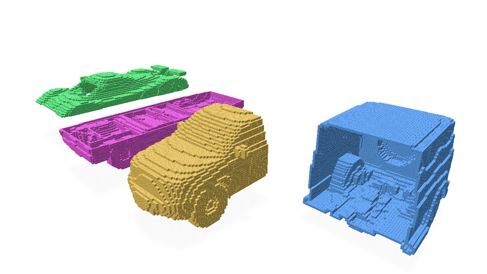


## Max/Mean Pooling

'Pooling' a grid has the effect of coarsening the resolution of the grid by a constant factor (and can be performed anisotropically for different factors in each `xyz` spatial dimension).  When pooling a grid, the values of the new, coarser grid can be determined by the maximum or mean of the values of the voxels in the original grid that are covered by each voxel in the new grid.  Maximum and mean pooling can be accomplished by the `max_pool` and `avg_pool` operators.

In this example, we create a grid from a mesh and then perform max and mean pooling on it to illustrate the difference between the two.

```python
import os
import fvdb
import torch
import numpy as np
import point_cloud_utils as pcu

vox_size = 0.02
num_pts = 10_000

mesh_files = ["car-25.ply",]

points = []
normals = []

for fname in mesh_files:
    pts, nms = pcu.load_mesh_vn(fname)
    pts, nms = torch.from_numpy(pts.astype(np.float32)).cuda(), torch.from_numpy(nms.astype(np.float32)).cuda()
    pmt = torch.randperm(pts.shape[0])[:num_pts]
    pts, nms = pts[pmt], nms[pmt]
    points.append(pts)
    normals.append(nms)

# JaggedTensors of points and normals
points = fvdb.JaggedTensor(points)
normals = fvdb.JaggedTensor(normals)

# Create a grid
grid = fvdb.sparse_grid_from_points(points, voxel_sizes=vox_size)

# Splat the normals into the grid with trilinear interpolation
vox_normals = grid.splat_trilinear(points, normals)

# Mean Pooling of normals features
avg_normals, avg_grid = grid.avg_pool(4, vox_normals)
# Max Pooling of normals features
max_normals, max_grid = grid.max_pool(4, vox_normals)
```

We visualize the original grid with values of the mesh normals as features, the features/grid after mean pooling, and the features/grid after max pooling to illustrate how these pooling modes affect the resulting features of the grid.

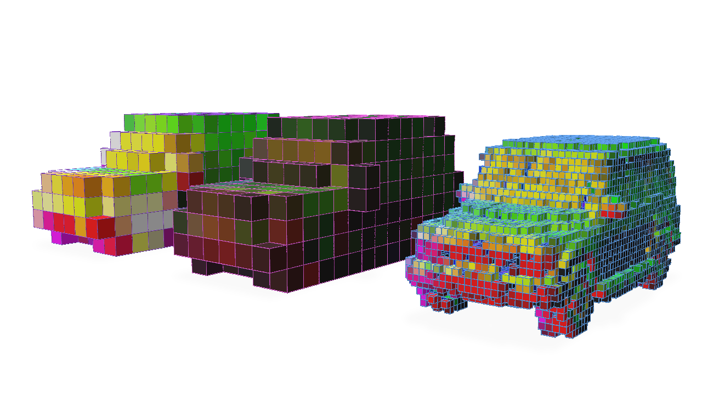


## Subdividing a grid

Subdividing a grid has the effect of increasing the resolution of the grid by a constant factor (and can be performed anisotropically for different factors in each `xyz` spatial dimension).

The most straightforward way to use the `subdivide` method is to provide an integer value for the subdivision factor.  This will result in a grid that is `subdiv_factor` times the resolution of the original grid in each spatial dimension.

```python
import os
import fvdb
import torch
import numpy as np
import point_cloud_utils as pcu

vox_size = 0.02
num_pts = 10_000

mesh_files = ["car-25.ply",]

points = []
normals = []

for fname in mesh_files:
    pts, nms = pcu.load_mesh_vn(fname)
    pts, nms = torch.from_numpy(pts.astype(np.float32)).cuda(), torch.from_numpy(nms.astype(np.float32)).cuda()
    pmt = torch.randperm(pts.shape[0])[:num_pts]
    pts, nms = pts[pmt], nms[pmt]
    points.append(pts)
    normals.append(nms)

# JaggedTensors of points and normals
points = fvdb.JaggedTensor(points)
normals = fvdb.JaggedTensor(normals)

# Create a grid
grid = fvdb.sparse_grid_from_points(points, voxel_sizes=vox_size)

# Splat the normals into the grid with trilinear interpolation
vox_normals = grid.splat_trilinear(points, normals)

# Subdivide by a constant factor of 2
subdiv_normals, subdiv_grid = grid.subdivide(2, vox_normals)
```

Here we visualize the original grid on the right and the grid after subdivision by a factor of 2 on the left.

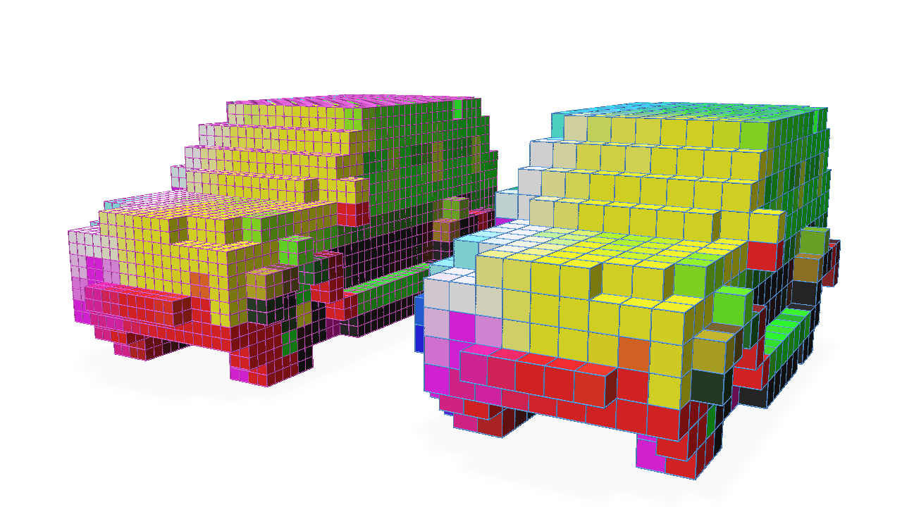


In practice, in a deep neural network like a U-Net architecture, the resolution of the grid can be decreased early in the network and then the grid's features need to be concatenated with features of the grid after its resolution is increased again.  When working with traditional, dense 2D or 3D data, cropping any mismatched outputs is straightforward to be able to concatenate these features.  However, in a sparse 3D grid, this is not straightforward and it's entirely unclear how to align the features.

Take this simple example to illustrate the difficulties created by changing the grid topology in this way.  We take the grid created from our mesh, perform Pooling by a factor of 2 and then try to Subdivide by an equal factor of 2 to invert the Pooling operation.

```python
max_normals, max_grid = grid.max_pool(2, vox_normals)

subdiv_normals, subdiv_grid = max_grid.subdivide(2, max_normals)
```


Let's visualize these results from left to right of the original grid, the grid after max pooling, and the grid after max pooling and then subdividing again by the same factor.

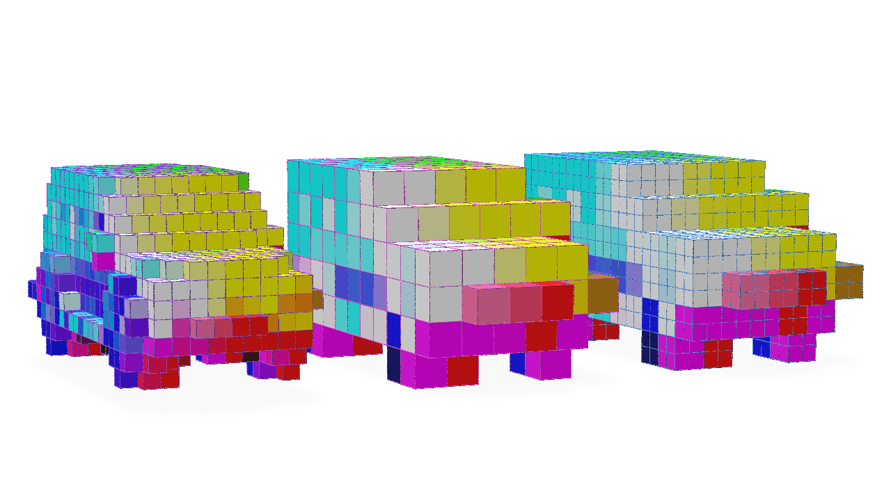


Notice how we have not obtained the topology of the original grid and have obtained a grid with many more voxels than the original.

To correctly invert the Pooling operation, we can provide the `subdivide` function with a `fine_grid` optional argument which describes the topology we want the grid to have after the subdivision.  The original grid before the Pooling operation can be used as this `fine_grid`.

```python
max_normals, max_grid = grid.max_pool(2, vox_normals)

# Providing the original grid as our fine_grid target
subdiv_normals, subdiv_grid = max_grid.subdivide(2, max_normals, fine_grid=grid)
```

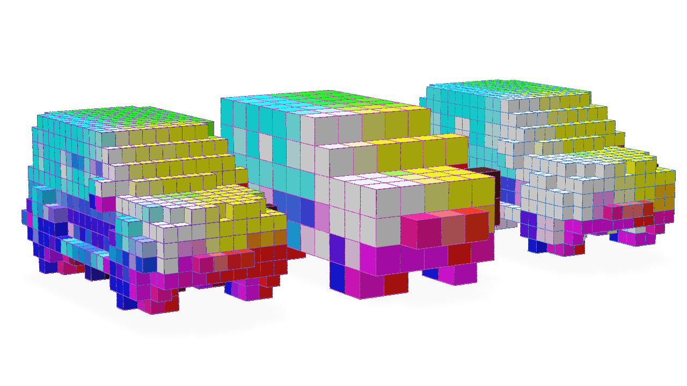


Note the matching topology of the grid after the Subdivision operation to the original grid (though the features are different due to the Pooling operation).

One other useful feature of the `subdivide` operator is that this operation can be *masked* so that subdivision is only performed on a subset of the voxels in the grid.

The optional `mask` argument to `subdivide` is a `JaggedTensor` of boolean values that indicates which voxels should be subdivided.  Given this `mask` is simply a `JaggedTensor`, this operation can be made differentiable in a neural network and the `subdivide` operator can be learned.

Let's illustrate a very simple example of how to use the `mask` argument to only subdivide the voxels which have a feature value greater than a certain threshold.

```python
# Mask the grid with the normals where only the normals with a value greater than 0.5 on the x-axis are subdivided
mask = vox_normals.jdata[:, 0] > 0.5

subdiv_normals, subdiv_grid = grid.subdivide(2, vox_normals, mask=mask)
```

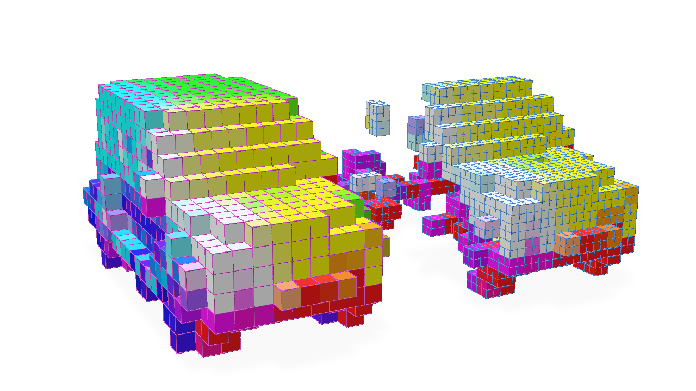


## Getting the number of enabled voxels per grid in a batch

Getting the number of voxels in the grids of a `GridBatch` can be easily accomplished with `num_voxels`:

```python
import fvdb
import torch

# Create a GridBatch of random points
batch_size = 4
pts = fvdb.JaggedTensor([torch.rand(10_000*(i+1),3) for i in range(batch_size)])
grid = fvdb.GridBatch(mutable=False)
grid.set_from_points(pts, voxel_sizes=0.02)

# Get the number of voxels per grid in the batch
for batch, num_voxels in enumerate(grid.num_voxels):
    print(f"Grid {batch} has {num_voxels} voxels")
```
```bash
Grid 0 has 9645 voxels
Grid 1 has 18503 voxels
Grid 2 has 26749 voxels
Grid 3 has 34378 voxels
```

If the grid is *mutable* and the number of enabled voxels has changed, you can use `num_enabled_voxels` to get the number of *enabled* voxels.  If a grid is not mutable, `num_enabled_voxels` will return the same value as `num_voxels`.

```python
# Create a mutable GridBatch of random points
grid = fvdb.GridBatch(mutable=True)
grid.set_from_points(pts, voxel_sizes=0.02)
# Disable some voxels randomly
grid.disable_ijk(fvdb.JaggedTensor([torch.randint(0,50,(100_000,3)) for _ in range(batch_size)]))

# Get the number of enabled voxels per grid in the batch
for batch, num_voxels in enumerate(grid.num_enabled_voxels):
    print(f"Grid {batch} has {grid.num_enabled_voxels_at(batch)} enabled voxels and {grid.num_voxels_at(batch)} total voxels")
```
```bash
Grid 0 has 4434 enabled voxels and 9645 total voxels
Grid 1 has 8620 enabled voxels and 18503 total voxels
Grid 2 has 12456 enabled voxels and 26749 total voxels
Grid 3 has 16155 enabled voxels and 34378 total voxels
```

## Converting between ijk (grid) coordinates and world coordinates

A `GridBatch` can contain multiple grids, each with its own coordinate system that relate the grids' `ijk` integer index space coordinates to `xyz` floating-point world-space coordinates.  These axis-aligned coordinate systems are defined by specifying a list of three-dimensional world-space origin and scale values when we define the topology of the grids in the `GridBatch` like so:

```python
import fvdb
import torch

# Create a GridBatch of random points
batch_size = 4
pts = fvdb.JaggedTensor([torch.rand(10_000*(i+1),3) for i in range(batch_size)])
grid = fvdb.GridBatch()
grid.set_from_points(pts,
                    voxel_sizes=[[0.02, 0.02, 0.02], [0.03, 0.03, 0.03], [0.04, 0.04, 0.04], [0.05, 0.05, 0.05]],
                    origins=[[-.1,-.1,-.1], [0,0,0], [.1,.1,.1], [.2,-.2,.2]])
```

When `voxel_sizes` and `origins` are not defined, it is assumed all grids have a unit scale voxel_size and an origin at `[0.0, 0.0, 0.0]`.

We can use `GridBatch`'s `grid_to_world` function to convert between `ijk` index coordinates and their corresponding world-space `xyz` coordinates.  In this example, let's obtain the world-space position that would lie at the index-space `[1, 1, 1]` point of each grid:

```python
# Convert ijk coordinates to world coordinates
ijk = fvdb.JaggedTensor([torch.ones(1,3, dtype=torch.int) for _ in range(batch_size)])
world_coords = grid.grid_to_world(ijk)
for i in range(grid.grid_count):
    print(f"World-space point that lies at index [1,1,1] for Grid {i} is positioned at {world_coords.jdata[world_coords.jidx==i].tolist()}")
```
```bash
World-space point that lies at index [1,1,1] for Grid 0 is positioned at [[-0.07999999821186066, -0.07999999821186066, -0.07999999821186066]]
World-space point that lies at index [1,1,1] for Grid 1 is positioned at [[0.030000001192092896, 0.030000001192092896, 0.030000001192092896]]
World-space point that lies at index [1,1,1] for Grid 2 is positioned at [[0.14000000059604645, 0.14000000059604645, 0.14000000059604645]]
World-space point that lies at index [1,1,1] for Grid 3 is positioned at [[0.25, -0.15000000596046448, 0.25]]
```

We can also do the inverse operation and convert world-space `xyz` coordinates to their corresponding `ijk` index-space coordinates using `world_to_grid`.  In this example, let's find the `ijk` index coordinates of the voxel which would contain the world-space point located at `[1.0, 1.0, 1.0]` for each grid in our `GridBatch`:

```python
# Convert world coordinates to ijk coordinates
xyz = fvdb.JaggedTensor([torch.ones(1,3, dtype=torch.float) for _ in range(batch_size)])
ijk_coords = grid.world_to_grid(xyz)
for i in range(grid.grid_count):
    print(f"Index-space voxel that contains the point [1.0, 1.0, 1.0] for Grid {i} {ijk_coords.jdata[ijk_coords.jidx==i].int().tolist()}")
```
```bash
Index-space voxel that contains the point [1.0, 1.0, 1.0] for Grid 0 [[55, 55, 55]]
Index-space voxel that contains the point [1.0, 1.0, 1.0] for Grid 1 [[33, 33, 33]]
Index-space voxel that contains the point [1.0, 1.0, 1.0] for Grid 2 [[22, 22, 22]]
Index-space voxel that contains the point [1.0, 1.0, 1.0] for Grid 3 [[16, 24, 16]]
```

While `grid_to_world` and `world_to_grid` are convenient functions for these purposes, the row-major transformation matrices used for these calculations can be obtained directly from a `GridBatch` for use in your own logic:

```python
print(f"Grid to world matrices:\n{grid.grid_to_world_matrices}")
print(f"World to grid matrices:\n{grid.grid_to_world_matrices}")
```
```bash
Grid to world matrices:
tensor([[[ 0.0200,  0.0000,  0.0000,  0.0000],
         [ 0.0000,  0.0200,  0.0000,  0.0000],
         [ 0.0000,  0.0000,  0.0200,  0.0000],
         [-0.1000, -0.1000, -0.1000,  1.0000]],

        [[ 0.0300,  0.0000,  0.0000,  0.0000],
         [ 0.0000,  0.0300,  0.0000,  0.0000],
         [ 0.0000,  0.0000,  0.0300,  0.0000],
         [ 0.0000,  0.0000,  0.0000,  1.0000]],

        [[ 0.0400,  0.0000,  0.0000,  0.0000],
         [ 0.0000,  0.0400,  0.0000,  0.0000],
         [ 0.0000,  0.0000,  0.0400,  0.0000],
         [ 0.1000,  0.1000,  0.1000,  1.0000]],

        [[ 0.0500,  0.0000,  0.0000,  0.0000],
         [ 0.0000,  0.0500,  0.0000,  0.0000],
         [ 0.0000,  0.0000,  0.0500,  0.0000],
         [ 0.2000, -0.2000,  0.2000,  1.0000]]])
World to grid matrices:
tensor([[[ 0.0200,  0.0000,  0.0000,  0.0000],
         [ 0.0000,  0.0200,  0.0000,  0.0000],
         [ 0.0000,  0.0000,  0.0200,  0.0000],
         [-0.1000, -0.1000, -0.1000,  1.0000]],

        [[ 0.0300,  0.0000,  0.0000,  0.0000],
         [ 0.0000,  0.0300,  0.0000,  0.0000],
         [ 0.0000,  0.0000,  0.0300,  0.0000],
         [ 0.0000,  0.0000,  0.0000,  1.0000]],

        [[ 0.0400,  0.0000,  0.0000,  0.0000],
         [ 0.0000,  0.0400,  0.0000,  0.0000],
         [ 0.0000,  0.0000,  0.0400,  0.0000],
         [ 0.1000,  0.1000,  0.1000,  1.0000]],

        [[ 0.0500,  0.0000,  0.0000,  0.0000],
         [ 0.0000,  0.0500,  0.0000,  0.0000],
         [ 0.0000,  0.0000,  0.0500,  0.0000],
         [ 0.2000, -0.2000,  0.2000,  1.0000]]])
```


## Convolution

Convolving the features of a `GridBatch` can be accomplished with either a high-level `torch.nn.Module` derived class provided by `fvdb.nn` or with more low-level methods available with `GridBatch`, we will illustrate both techniques.

### High-level Usage with `fvdb.nn`

`fvdb.nn.SparseConv3d` provides a high-level `torch.nn.Module` class for convolution on `fvdb` classes that is an analogue to the use of `torch.nn.Conv3d`.  Using this module is the recommended functionality for performing convolution with `fvdb` because it not only manages functionality such as initializing the weights of the convolution and calling appropriate backend implementation functions but it also provides certain backend optimizations which will be illustrated in the [Low-level usage](#low-level-usage-with-gridbatch) section.

One thing to note is `fvdb.nn.SparseConv3d` operates on a class that wraps a `GridBatch` and `JaggedTensor` together into a convenience object, `fvdb.VDBTensor`, which is used by all the `fvdb.nn` modules.

A simple example of using `fvdb.nn.SparseConv3d` is as follows:

```python
import fvdb
import fvdb.nn as fvdbnn
import torch
import numpy as np
import point_cloud_utils as pcu

voxnum_pts = 10_000
_size = 0.02

mesh_files = ["car-25.ply",]

points = []
normals = []

for fname in mesh_files:
    pts, nms = pcu.load_mesh_vn(fname)
    pts, nms = torch.from_numpy(pts.astype(np.float32)).cuda(), torch.from_numpy(nms.astype(np.float32)).cuda()
    pmt = torch.randperm(pts.shape[0])[:num_pts]
    pts, nms = pts[pmt], nms[pmt]
    points.append(pts)
    normals.append(nms)

# JaggedTensors of points and normals
points = fvdb.JaggedTensor(points)
normals = fvdb.JaggedTensor(normals)

# Create a grid
grid = fvdb.sparse_grid_from_points(points, voxel_sizes=vox_size)

# Splat the normals into the grid with trilinear interpolation
vox_normals = grid.splat_trilinear(points, normals)

# VDBTensor is a simple wrapper of a grid and a feature tensor
vdbtensor = fvdbnn.VDBTensor(grid, vox_normals)

# fvdb.nn.SparseConv3d is a convenient torch.nn.Module implementing the fVDB convolution
conv = fvdbnn.SparseConv3d(in_channels=3, out_channels=3, kernel_size=3, stride=1, bias=False).to(vdbtensor.device)

output = conv(vdbtensor)
```
Let's visualize the original grid with normals visualized as colours alongside the result of these features after a convolution initialized with random weights:
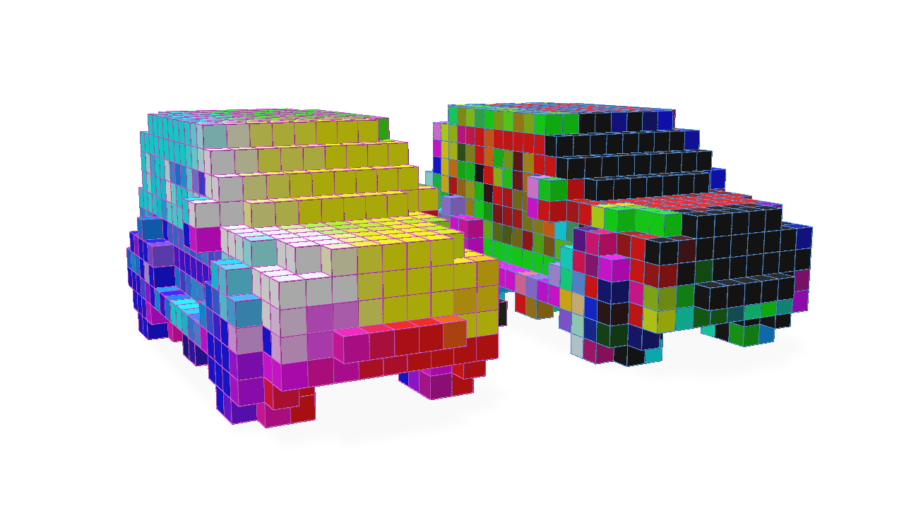

For stride values greater than 1, the output of the convolution will be a grid with a smaller resolution than the input grid (similar in topological effect to the output of a Pooling operator).  Let's illustrate this:

```python
# We would expect for stride=2 that the output grid would have half the resolution (or twice the world-space size) of the input grid
conv = fvdbnn.SparseConv3d(in_channels=3, out_channels=3, kernel_size=3, stride=2, bias=False).to(vdbtensor.device)

output = conv(vdbtensor)
```

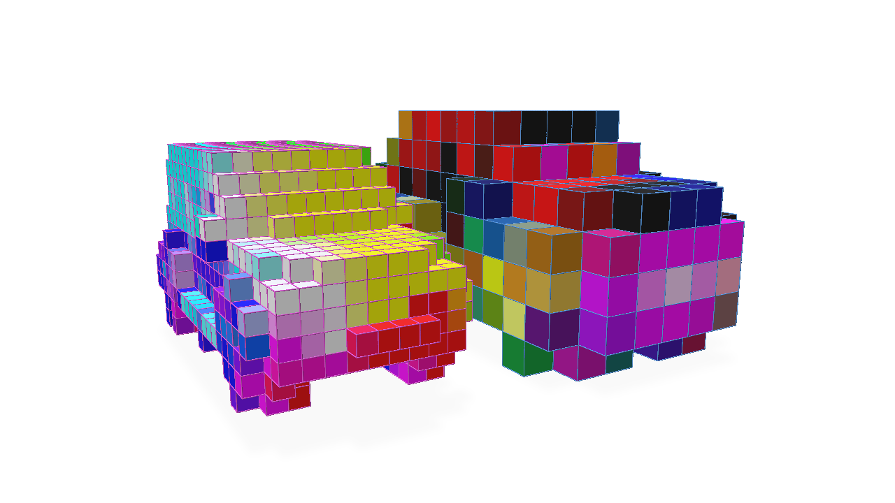


Transposed convolution can be performed with `fvdb.nn.SparseConv3d` which can increase the resolution of the grid.  It only really makes sense to perform transposed sparse convolution with a target grid topology we wish to produce with this operation (see the [Pooling Operators](#maxmean-pooling) for an explanation).  Therefore, an `out_grid` argument must be provided in this case to specify the target grid topology:

```python
# Tranposed convolution operator, stride=2
transposed_conv = fvdbnn.SparseConv3d(in_channels=3, out_channels=3, kernel_size=3, stride=2, bias=False, transposed=True).to(vdbtensor.device)

# Note the use of the `out_grid` argument to specify the target grid topology
transposed_output = transposed_conv(output, out_grid=vdbtensor.grid)
```

Here we visuzlie the original grid, the grid after strided convolution and the grid after transposed convolution inverts the topological operation of the strided convolution to produce the same topology as the original grid with the features convolved by our two layers:

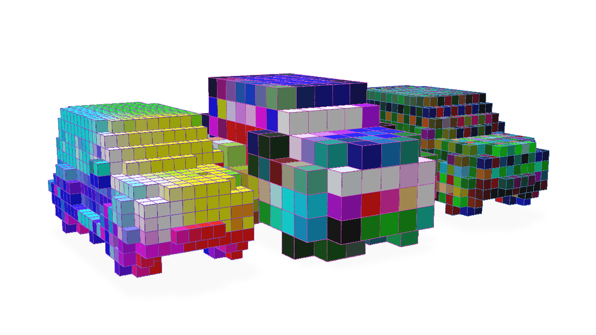


### Low-level Usage with `GridBatch`

The [high-level `fvdb.nn.SparseConv3d` class](#high-level-convolution-with-fvdbnn) wraps several pieces of `GridBatch` functionality to provide a convenient `torch.nn.Module` for convolution.  However, for a more low-level approach that accomplishes the same outcome, the `GridBatch` class itself can be the starting point for performing convolution on the grid and its features.  We will illustrate this approach for completeness, though we do recommend the use of the `fvdb.nn.SparseConv3d` Module for most use-cases.

Using the `GridBatch` convolution functions directly requires a little more knowledge about the implementation under-the-hood.  Due to the nature of a sparse grid, in order to make convolution performant, it is useful to pre-compute a mapping of which features in the input grid will contribute to the values of the output grid when convolved by a kernel of a particular dimension and stride.  This mapping structure is called a 'kernel map'.

The kernel map, as well as the functionality for using it to compute the convolution, is contained within a `fvdb.SparseConvPackInfo` class which can be constructed by `GridBatch.sparse_conv_kernel_map`.  A `fvdb.SparseConvPackInfo` must perform a pre-computation of the kernel map based on the style expected by the backend implementation of the convolution utilized by `fvdb.SparseConvPackInfo.sparse_conv_3d`.  Here is an example of how to construct a `fvdb.SparseConvPackInfo` and use it to perform a convolution:

```python
import fvdb
import fvdb.nn as fvdbnn
import torch
import numpy as np
import point_cloud_utils as pcu

voxnum_pts = 10_000
_size = 0.02

mesh_files = ["car-25.ply",]

points = []
normals = []

for fname in mesh_files:
    pts, nms = pcu.load_mesh_vn(fname)
    pts, nms = torch.from_numpy(pts.astype(np.float32)).cuda(), torch.from_numpy(nms.astype(np.float32)).cuda()
    pmt = torch.randperm(pts.shape[0])[:num_pts]
    pts, nms = pts[pmt], nms[pmt]
    points.append(pts)
    normals.append(nms)

# JaggedTensors of points and normals
points = fvdb.JaggedTensor(points)
normals = fvdb.JaggedTensor(normals)

# Create a grid
grid = fvdb.sparse_grid_from_points(points, voxel_sizes=vox_size)

# Splat the normals into the grid with trilinear interpolation
vox_normals = grid.splat_trilinear(points, normals)\

# Create the kernel map (housed in a SparseConvPackInfo) and the output grid's topology based on the kernel parameters
sparse_conv_packinfo, out_grid = grid.sparse_conv_kernel_map(kernel_size=3, stride=1)

# The kernel map must be pre-computed based on the backend implementation we plan on using, here we use gather/scatter, the default implementation
sparse_conv_packinfo.build_gather_scatter()

# Create random weights for our convolution kernel of size 3x3x3 that takes 3 input channels and produces 3 output channels
kernel_weights = torch.randn(3, 3, 3, 3, 3, device=grid.device)

# Perform convolution on the normals colours.  Gather/scatter is used as the backend, it is the default
conv_vox_normals = sparse_conv_packinfo.sparse_conv_3d(vox_normals, weights=kernel_weights, backend=fvdb.ConvPackBackend.GATHER_SCATTER)
```
Here we visualize the output of our convolution alongside the original grid with normals visualized as colours:
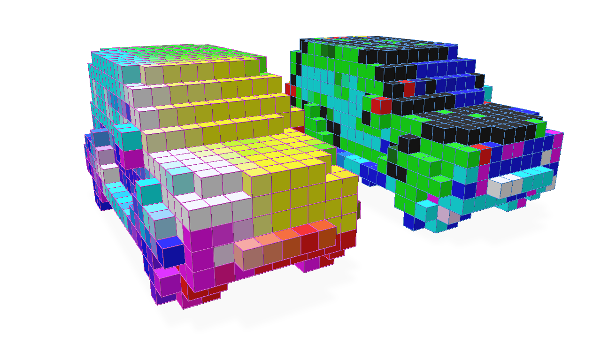

The kernel map can potentially be expensive to compute, so it is often useful to re-use the `SparseConvPackInfo` in the same network to perform a convolution on other features or with different weights.  This optimization is something `fvdb.nn.SparseConv3d` attempts to do where appropriate and is one reason we recommend using `fvdb.nn.SparseConv3d` over this low-level approach.