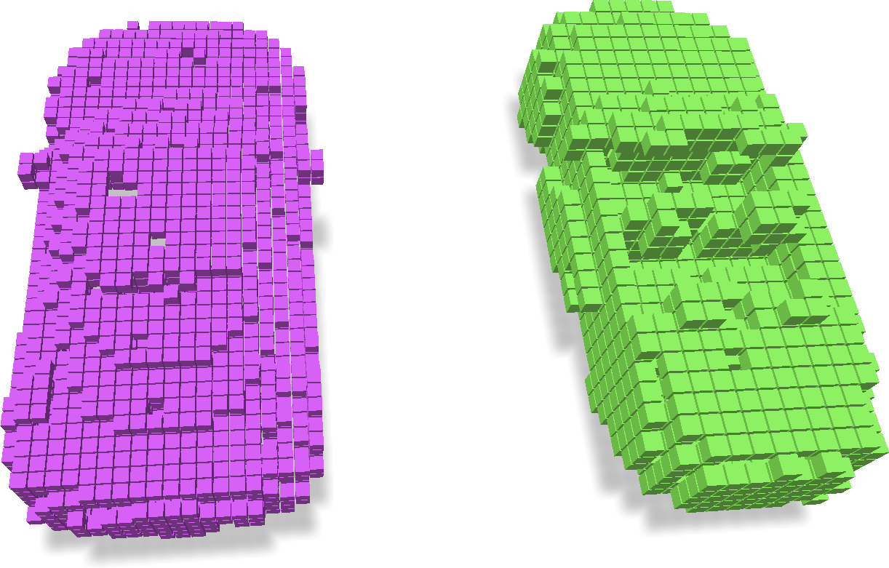
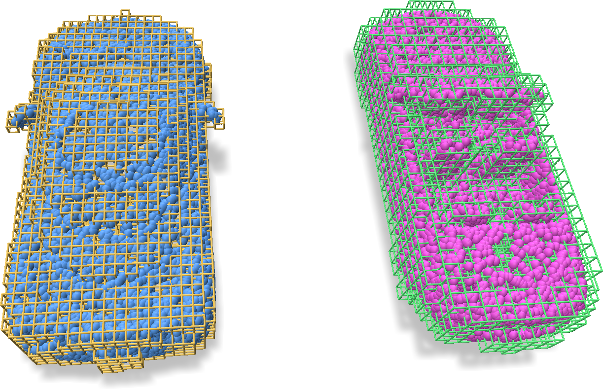
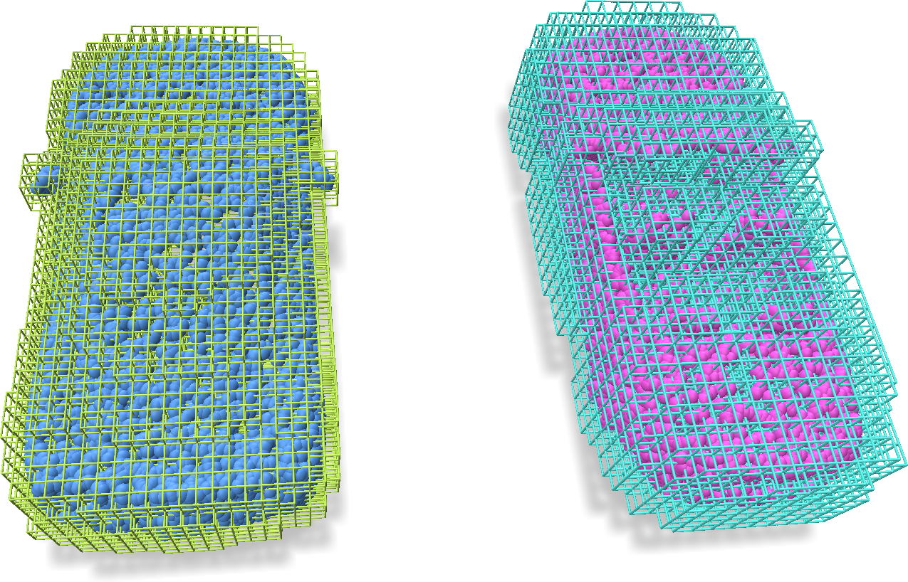
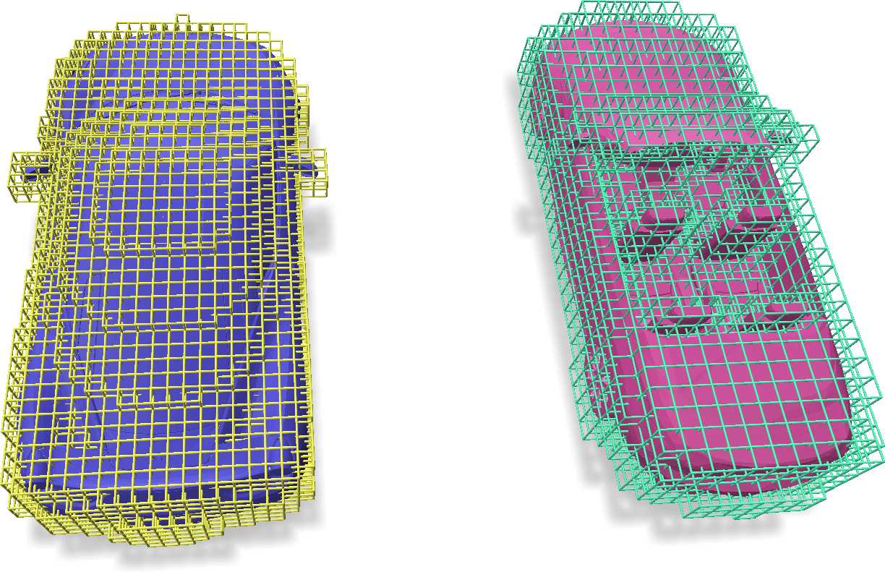
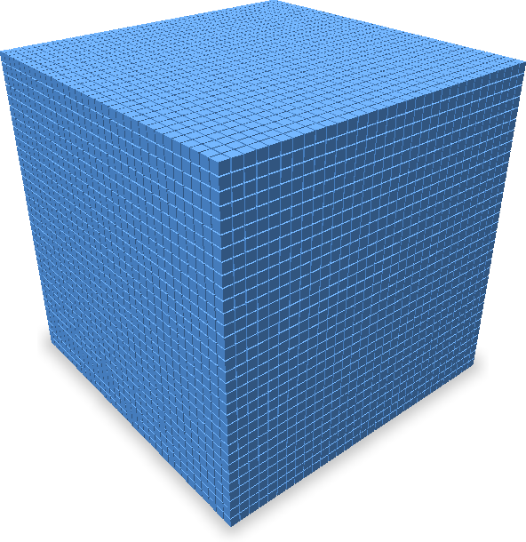
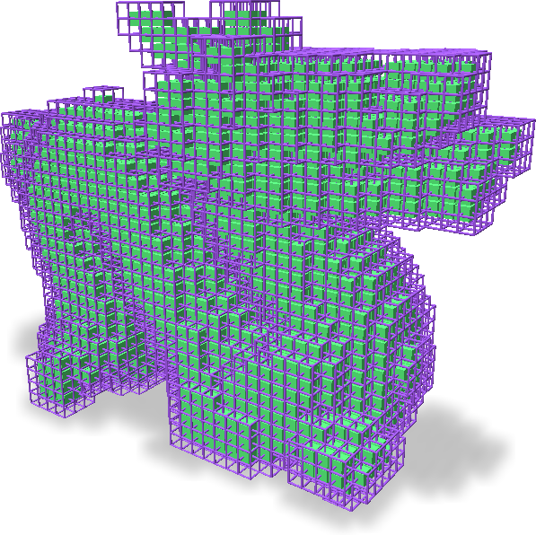
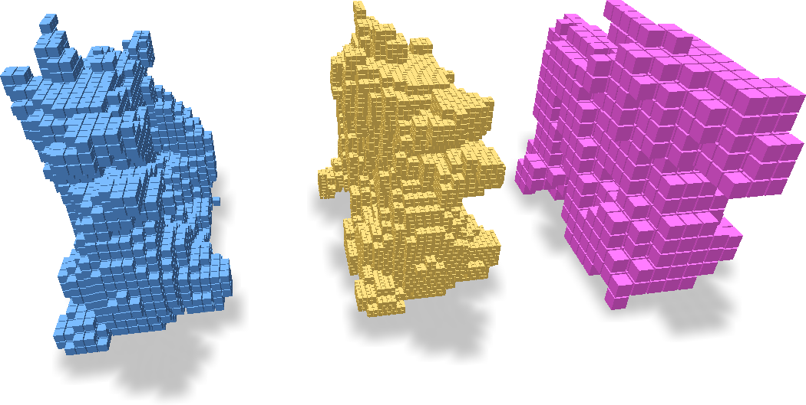

# Building Sparse Grids

We introduce several ways to construct sparse voxel grids from various data sources including point clouds, coordinate lists, triangle meshes, and deriving from other grids.
All the examples below could be found in full version (including visualization) at `examples/grid_building.py` and `examples/grid_subdivide_coarsen.py`.

## From Coordinate Lists

If you already have an integer list of the `ijk` coordinates for each voxel in the grid, you could directly build grids from the list.
Additionally, you will have to specify the voxel sizes and voxel origins for the grid.
An example is as follows:

```python
import torch
import fvdb

coords_jagged = JaggedTensor([
    torch.from_numpy(coords_1).long().cuda(),
    torch.from_numpy(coords_2).long().cuda()
])
voxel_sizes = [[0.1, 0.1, 0.1], [0.15, 0.15, 0.15]]

grid = fvdb.sparse_grid_from_ijk(coords_jagged, voxel_sizes=voxel_sizes, origins=[0.0] * 3)
```

The above code assumes that you want to build a grid with two batch elements, one with voxel size `[0.1, 0.1, 0.1]`, and the other with voxel size `[0.15, 0.15, 0.15]` (although usually you just want all the elements in your batch to have the same size, in which case you could just pass in `voxel_sizes=[0.1, 0.1, 0.1]`).
The same logic applies for `origins` that specifies the world coordinates of voxel `(0, 0, 0)`, which we set to the origin here.
The grid will be constructed on the same device as `coords_jagged`, which is a `JaggedTensor`. The JaggedTensor is built from two numpy `int64` arrays with size `[*, 3]` called `coords_1` and `coords_2`.



## From Point Clouds

You could either choose to quantize the coordinates of your point cloud into `ijk` coordinates yourself (e.g. using `np.unique((xyz / voxel_size).floor(), axis=0)`), or let `fvdb` handle this logic. Specifically, you could do:

```python
# Assemble point clouds into JaggedTensor
pcd_jagged = JaggedTensor([
    torch.from_numpy(pcd_1).float().cuda(),
    torch.from_numpy(pcd_2).float().cuda()
])
voxel_sizes = [[0.1, 0.1, 0.1], [0.15, 0.15, 0.15]]

# Method 1:
grid_a1 = fvdb.sparse_grid_from_points(pcd_jagged, voxel_sizes=voxel_sizes, origins=[0.0] * 3)

# Method 2:
grid_a2 = fvdb.GridBatch(device=pcd_jagged.device)
grid_a2.set_from_points(pcd_jagged, voxel_sizes=voxel_sizes, origins=[0.0] * 3)
```

Above we show two methods of building grids from points. Similar functions exist for other grid building approaches. The built grids are shown as following:



In some applications, you may want to build a dilated version of the grid by ensuring that all $2\times 2 \times 2$ voxels around each point are included in the built grid. That said, you could build the grid by:

```python
# Build grid from containing nearest voxels to the points
grid_b = fvdb.sparse_grid_from_nearest_voxels_to_points(pcd_jagged, voxel_sizes=voxel_sizes, origins=[0.0] * 3)
```




## From Meshes

We allow building grids enclosing a triangle mesh easily. The given triangle mesh does not have to be manifold nor watertight and it will be treated as a triangle soup internally.
An example to build grids from meshes is shown as follows:

```python
mesh_v_jagged = JaggedTensor([
    torch.from_numpy(mesh_1_v).float().cuda(),
    torch.from_numpy(mesh_2_v).float().cuda()
])
mesh_f_jagged = JaggedTensor([
    torch.from_numpy(mesh_1_f.astype(np.int64)).long().cuda(),
    torch.from_numpy(mesh_2_f.astype(np.int64)).long().cuda()
])

voxel_sizes = [[0.1, 0.1, 0.1], [0.15, 0.15, 0.15]]
grid = fvdb.sparse_grid_from_mesh(mesh_v_jagged, mesh_f_jagged, voxel_sizes=voxel_sizes, origins=[0.0] * 3)
```

Here `mesh_1_v` and `mesh_1_f` are the vertex array and triangle array of the mesh to build grid from, with the shape of $(V, 3)$ and $(F, 3)$. The triangle array is an integer array that indexes into the vertex array (starting from 0 for each element in the batch). Same for another `mesh_2_v` and `mesh_2_f`.



## From Dense

We have APIs for you to build dense grids of shape $(D, H, W)$ containing the full $D\times H \times W$ voxels.

```python
grid = fvdb.sparse_grid_from_dense(num_grids=1, dense_dims=[32, 32, 32], device="cuda")
```



If you are comparing the performance of dense pytorch 3D tensors vs sparse grids, it is usually very helpful to build the exact same input (including grid and features). In `fvdb.nn`, we provide a thin wrapper class `VDBTensor` that works like a `torch.Tensor`, yet enclosing the grid topology. To convert data back and forth from dense PyTorch `Tensor`s, we could do:

```python
from fvdb.nn import VDBTensor

# Easy way to initialize a VDBTensor from a torch 3D tensor [B, D, H, W, C]
dense_data = torch.ones(2, 32, 32, 32, 16).cuda()
sparse_data = VDBTensor.from_dense(dense_data, voxel_sizes=[0.1] * 3)
dense_data_back = sparse_data.to_dense()
assert torch.all(dense_data == dense_data_back)
```

Here `sparse_data` will be a `fvdb.nn.VDBTensor` class, containing both `feature` and `grid` attribute.
Such a class could be fed into all the neural network components available in `fvdb.nn`.

## Deriving from other grids

### Dual grid

A dual grid (of a primal grid) is also a grid, with its voxel *centers* covering the *corners* of the primal grid, and *corners* taking the positions of the *centers* of the primal grid.
A dual grid shares the same voxel sizes as its primal grid, and is just a simple shift of half the voxel size in translation.
In the picture below, green grid is the primal grid while purple grid is its dual.



To create a dual grid from a given primal grid, use the following code:

```python
grid_dual = grid_primal.dual_grid()
```

### Subdividing and Coarsening a grid

The grid could be subdivided or coarsened with a subdivision/coarsening factor provided:

```python
grid_subdivided = grid_origin.subdivided_grid(2)
grid_coarsened = grid_origin.coarsened_grid(2)
```



The features associated with the grids could be processed via the examples in `Grid Operations`.
Refer to the corresponding section for more details.
