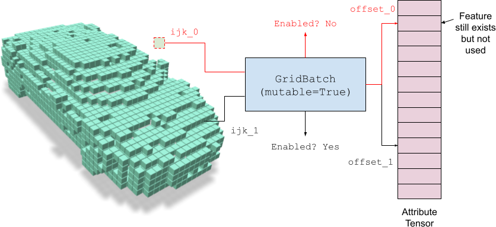
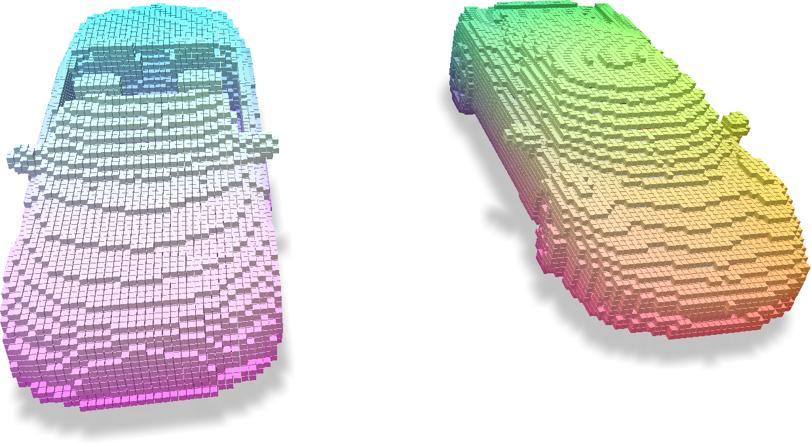
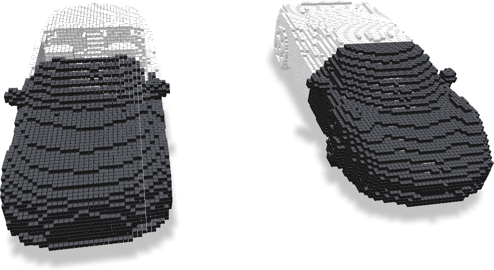
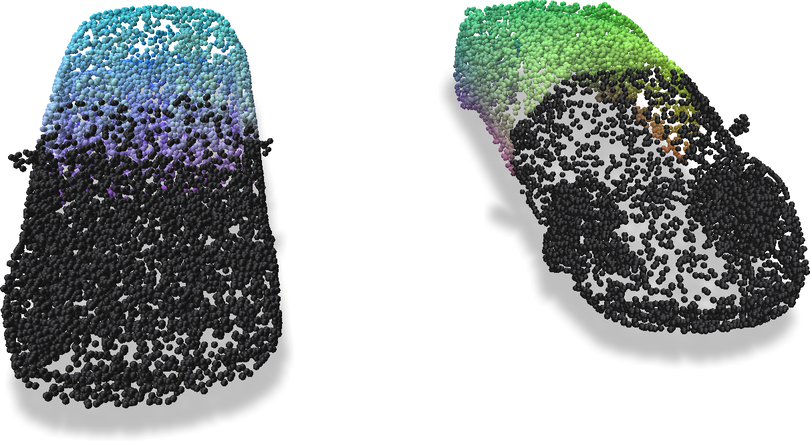
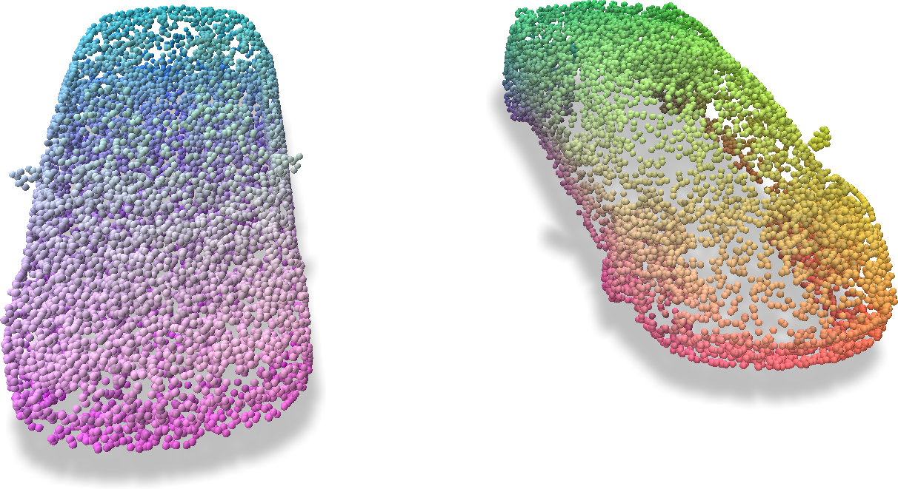
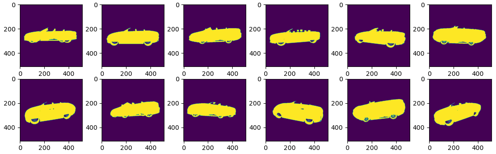

# Mutable Grids

## Concepts

Mutable grids refer to `GridBatch` whose voxels can be turned 'off'.
Each voxel hence not only stores an integer offset that indexes into the external feature array, but also includes a bit switch indicating whether the voxel exist or not.



The ability to turn on (enable) voxels and turn off (disable) voxels make it easier for downstream tasks such as structural optimization and neural rendering.
Note that even if you disable some voxels, the corresponding entry in the feature array still exists.
Such a design keeps the feature unchanged while changing the grid topology in a flexible way.

## Examples

### Basic example

Mutable grids can be created by adding `mutable=True` arguments into the grid building function.
For example:

```python
import fvdb

# Create mutable grid
grid = fvdb.sparse_grid_from_mesh(
    mesh_v_jagged, mesh_f_jagged,
    voxel_sizes=[0.01] * 3, origins=[0.0] * 3,
    mutable=True
)

# Create additional features for visualization purpose
feature = grid.grid_to_world(grid.ijk.float())
feature.jdata = (feature.jdata - feature.jdata.min(dim=0).values) / \
    (feature.jdata.max(dim=0).values - feature.jdata.min(dim=0).values)
```



Voxels can be disabled in batches via `disable_ijk`:

```python
# Get the IJK coordinates to be disabled
disable_ijk: fvdb.JaggedTensor = grid.ijk.r_masked_select(feature.jdata[:, 0] > 0.5)

# Disable them!
grid.disable_ijk(disable_ijk)
```

Once disabled, those voxels will virtually disappear, meaning that all subsequent grid operations such as sampling, splatting, or ray marching, will treat those voxels as they do not exist.
One can visualize the enable mask via:

```python
enabled_mask = grid.enabled_mask
```



Note that in the above figure, white voxels are those still enabled, while black voxels are disabled voxels.
To verify, we try to sample features from the grid to a set of sampled points:

```python
pts_feature = grid.sample_trilinear(pcd_jagged, feature)
```



Because the disabled voxels will be treated as non-existing, no voxels will contribute to the features on the points at the front. Hence those points are marked as black (i.e. feature = 0).

The disabled voxels could be revived at any time using `enable_ijk`:

```python
grid.enable_ijk(disable_ijk)
```

Conducting the same feature sampling with `sample_trilinear`, one can get the full features being correctly sampled.



### Structure optimization

In this example, we will cover a more advanced topic to perform structure optimization from images.
Suppose we have the following observations of a single object's mask:



The task is to recover the underlying 3D shape from the images. Here we use the underlying representation of our VDB grid.
Such a problem could be solved in many different ways, with one obvious one being space culling.
However, to demonstrate the wide applicability and flexibility of fVDB, we will take the differentiable rendering approach here.
Each voxel is hereby given an opacity value, and the entire sparse grid is volume rendered into a predicted mask.
A simple L1 loss is compared between the given ground-truth mask and the predicted mask to force them align.

To begin, we create a mutable grid and the corresponding opacity (`alpha`) by:
```python
import fvdb

init_resolution = 96

# Suppose our shape lies within the unit bounding box from [-0.5, 0.5, 0.5] to [0.5, 0.5, 0.5]
grid = fvdb.sparse_grid_from_dense(
    num_grids=1, dense_dims=[init_resolution] * 3,
    voxel_sizes=[1.0 / (init_resolution - 1)] * 3, origins=[-0.5, -0.5, -0.5],
    device="cuda",
    mutable=True
)
alpha = torch.full((grid.total_voxels, ), inv_sigmoid(0.1), device=grid.device, requires_grad=True)
```

The structure optimization is done via `torch`'s Adam optimizer, with the loop being:

```python
optimizer = torch.optim.Adam([alpha], lr=1.0)

# Optimization loop
for it in range(100):
    # Subsample rays from the given camera poses.
    sub_inds = torch.randint(0, ray_orig.shape[0], (10000, ), device=grid.device)
    pd_opacity = render_opacity(
        grid, torch.sigmoid(alpha),
        ray_orig=ray_orig[sub_inds], ray_dir=ray_dir[sub_inds]
    )
    gt_opacity = ray_opacity[sub_inds]

    # Compute L1 loss
    loss = torch.mean(torch.abs(pd_opacity - gt_opacity))

    optimizer.zero_grad()
    loss.backward()
    optimizer.step()
```

Here `render_opacity` is an approximate differentiable rendering algorithm like:

```python
pack_info, voxel_inds, out_times = grid.voxels_along_rays(ray_orig, ray_dir, 128, 0.0)
voxel_inds = grid.ijk_to_index(voxel_inds).jdata

rgb, depth, opacity, _, _ = fvdb.utils.volume_render(
    sigmas=-torch.log(1 - feature[voxel_inds]),
    rgbs=torch.ones((voxel_inds.shape[0], 1), device=grid.device),
    deltaTs=torch.ones(voxel_inds.shape[0], device=grid.device),
    ts=out_times.jdata.mean(1),
    packInfo=pack_info.jdata, transmittanceThresh=0.0
)
```

During the optimization, the voxels of the grid could be disabled or enabled freely.
In this example, we demonstrate the following strategy similar to Instant-NGP.

```python
if it > 0 and it % 5 == 0:
    # Disable voxels that are transparent
    bad_mask = torch.sigmoid(alpha) < 0.1
    grid.disable_ijk(grid.ijk.r_masked_select(bad_mask))

    # Randomly revive voxels at the beginning.
    if it < 20:
        enable_mask = torch.rand(grid.total_voxels, device=grid.device) < 0.01
        grid.enable_ijk(grid.ijk.r_masked_select(enable_mask))
```

Note that a way simpler strategy that only turns voxels off at a much sparse internal also works in this very simplified scenario.
The snippet above is solely for demonstration purpose of our API.

The optimization procedure looks as follows. One can see that we are able to recover the ground-truth voxel structure of the provided car.


A full runnable example could be found at `examples/structure_optimization.py`.
